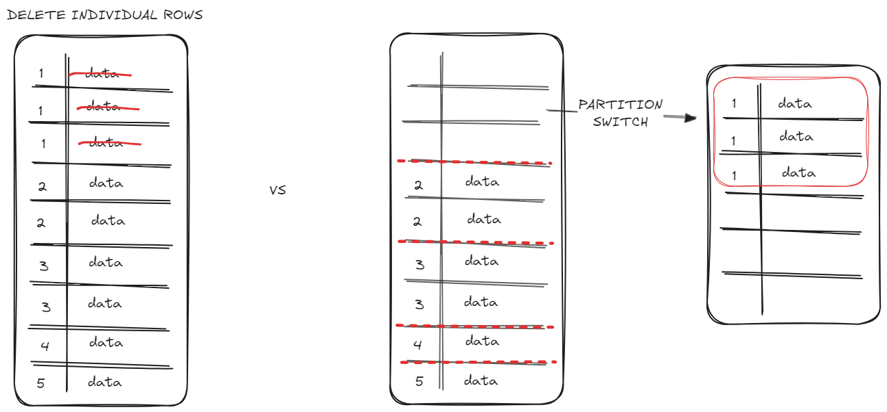

# Case Study: Improving Delete performance using Partition Switching

## Introduction
Recently a customer was seeing performance drops while doing a weekly cleanup of a table. This cleanup consisted of finding all rows with a given id (*batch_id, an integer with 4 digits*) and deleting those rows. This table would hold over 100 million rows and this weekly cleanup could represent over 50% of the total row size (*several ids to be deleted*).

While this operation was very IO intensive, it also had very clear and simple steps, which could be improved by splitting them into minimally logged operations that are easier to managed by the SQL engine.

Instead of searching and deleting the rows individually, if they were already split into partitions it would be faster to identify them and move them into a an empty table. This additional table could then be Truncated, which is a negligible workload when compared to deleting millions of individual rows.

Because this process is triggered from Azure Data Factory, I've created stored procedures to simplify the process of creating/switching/deleting the partitions.

## Pre-Requisites

1. **Clone the main table's structure**: Create an identical table with the same schema as the original table.
1. **Create the stored procedures**: The stored procedures are here just to simplify the process, so it can easily be called from external applications (*such as Azure Data Factory*) with parameters for the batch_id to be processed.

&nbsp;

&nbsp;
## Workflow for data load

1. **Identify the batch_id**: Assign a new batch_id for the incoming rows, based on business logic.

2. **Create a new partition the batch_id**: Execute the usp_create_table_partition.

3. **Load data**.
&nbsp;

&nbsp;
## Workflow for data deletion

1. **Identify the batch_id**: Determine the batch_id for the rows that need to be deleted.

2. **Switch the partition**: Execute the usp_switch_partition, receives parameters for source and target table, as well as batch_id.

4. **Truncate the target table**: Minimally logged operation, faster than searching individual rows.

5. **Delete the partition**: Depends on use case, but should be executed to ensure the partition limit (*15000*) is not reached.

&nbsp;

&nbsp;

## Benchmarks:
- Azure SQL database, Hyperscale, 2 vCores
- Pre-loaded table with 74 million rows, no NULL values.
- Tables are indexed on `batch_id`

&nbsp;

&nbsp;
## Insert data into SQL table, Partitioned vs Non-Partitioned

| Run | Partitioned | Non-Partitioned |
|-----|------------------:|-----------------:|
| 1   | 00:01:40.980      | 00:02:27.440     |
| 2   | 00:02:09.740      | 00:02:16.750     |
| 3   | 00:01:41.640      | 00:02:14.610     |

&nbsp;

&nbsp;
## Switching a partition vs Deleting an empty partition vs Deleting rows

| Run | Switch partition | Delete an empty partition | Delete rows | Delete rows |
|-----|------------------:|--------------------------:|-------------|-------------|
|     |                  |                           | (*partitioned table*) | (*non-partitioned table*) |
| 1   | 00:00:00.113      | 00:00:00.901              | 00:00:20.796 | 00:00:17.833 |
| 2   | 00:00:00.075      | 00:00:00.423              | 00:00:17.707 | 00:00:17.233 |
| 3   | 00:00:00.066      | 00:00:00.622              | 00:00:16.571 | 00:00:18.445 |

